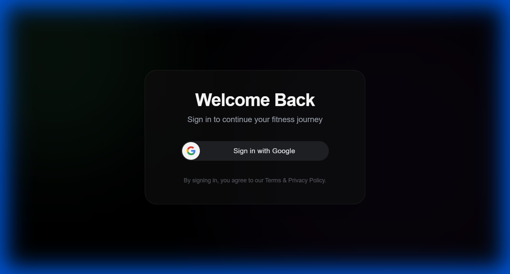

# FitTrack - Intelligent Fitness Companion (v2.0)


FitTrack is a modern, full-stack fitness tracking application designed to help you monitor your workouts, nutrition, and daily habits with precision and style. Version 2.0 introduces secure Google Authentication, a revamped UI, and detailed analytics.

## 🚀 New in Version 2.0
*   **🔐 Secure Google Login**: One-click sign-in using your Google account.
*   **✨ Animated Onboarding**: A beautiful 3-step introduction to the app's features.
*   **👤 User Profiles**: Personalized experience with profile picture and name display.
*   **📊 Enhanced Reporting**: CSV exports, daily scoring (0-10), and detailed weight tracking.
*   **🎨 Modern UI**: Glassmorphism effects, smooth transitions, and a responsive design.

## 📸 Screenshots

### Modern Login Screen

*Secure and stylish entry point with animated background effects.*

### Interactive Dashboard
*Real-time tracking of your daily goals, calories, and workout progress.*

## 🛠️ Tech Stack
*   **Frontend**: React (Vite), Tailwind CSS, Framer Motion, Lucide React
*   **Backend**: Node.js, Express, MongoDB, Mongoose
*   **Auth**: Google OAuth 2.0, JWT (JSON Web Tokens)
*   **Tools**: Axios, Recharts, React Router

## 📦 Installation

1.  **Clone the repository**
    ```bash
    git clone https://github.com/gauravsingh112/fitness-tracker.git
    cd fitness-tracker
    ```

2.  **Install Dependencies**
    ```bash
    # Frontend
    npm install

    # Backend
    cd backend
    npm install
    ```

3.  **Environment Setup**
    Create a `.env` file in the `backend` directory:
    ```env
    PORT=5000
    MONGO_URI=your_mongodb_uri
    JWT_SECRET=your_jwt_secret
    GOOGLE_CLIENT_ID=your_google_client_id
    ```
    Create a `.env` file in the root directory:
    ```env
    VITE_GOOGLE_CLIENT_ID=your_google_client_id
    ```

4.  **Run the App**
    ```bash
    # Terminal 1 (Backend)
    cd backend
    npm start

    # Terminal 2 (Frontend)
    npm run dev
    ```

## 🔒 Security Note
This repository does **not** contain any API keys or database credentials. All sensitive information is managed via environment variables.

## 🤝 Contributing
Contributions are welcome! Please feel free to submit a Pull Request.

---
*Built with ❤️ by Gaurav Singh*
